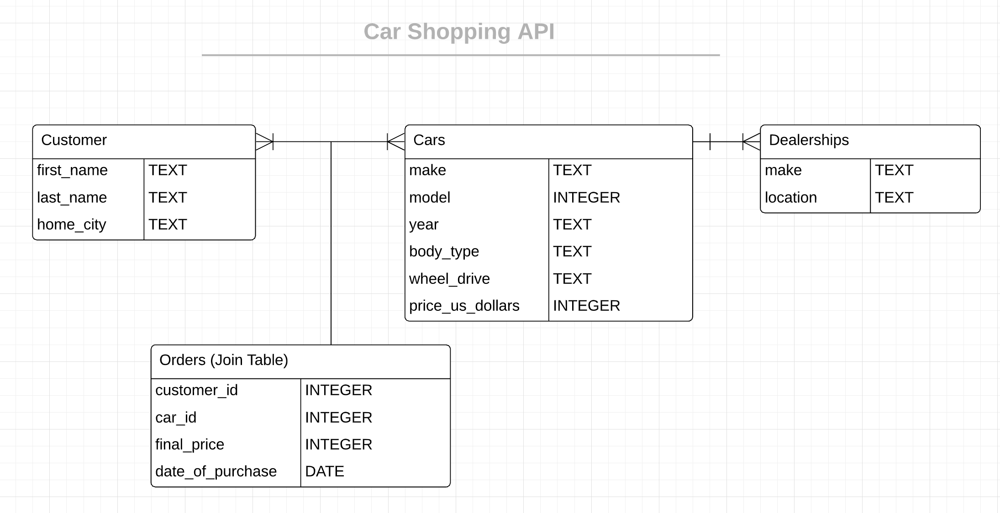
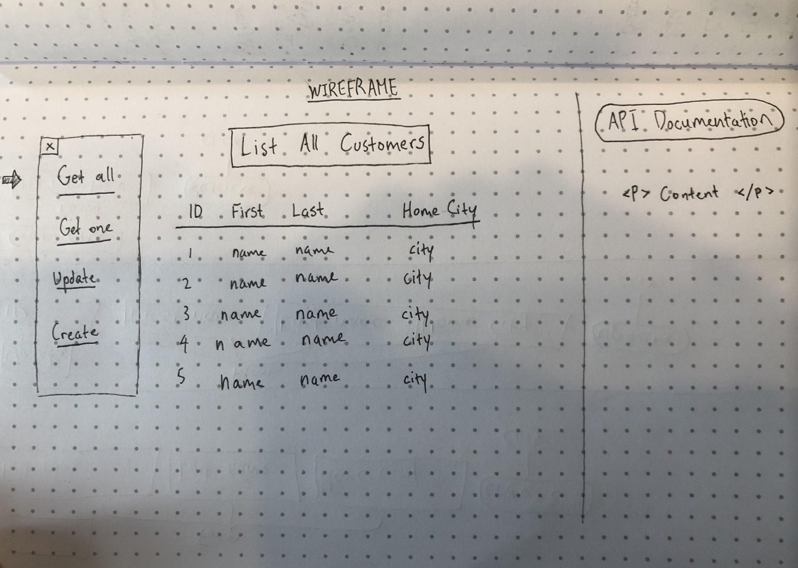
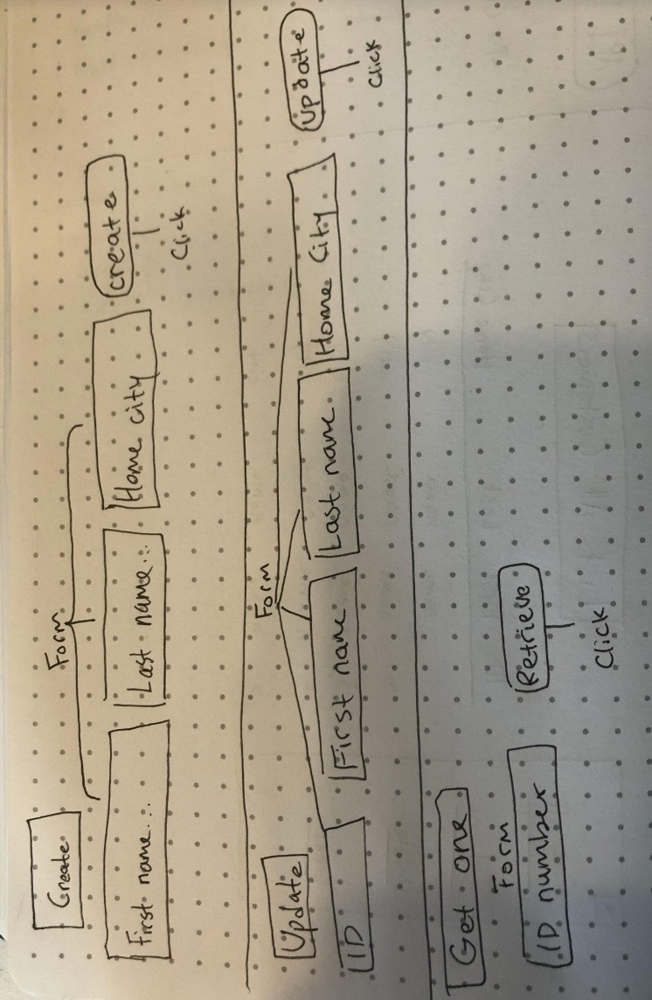

# Car Shopping API
* Note: this project is in progress.
* This project is a tool to test, update, and create the car shopping API on the browser.  
* Car shopping API implements full CRUD operations using SQLite server database.  

## Technologies Used 
* Node  
* Express  
* React  
* Lucidcharts ERD  

#### This API allows you to get the acquire information on top car dealerships in Bay Area as well as each customer information and their purchase order of the car. All endpoints are under **localhost:9000/api/**. Listed below are the documentations and can be operated using Postman Application. 

## Entity Relationship Diagram 

## Customers request 

|   Requests      | Path        | Description |
| ----------- | ----------- | ----------- |
|  GET | /api/customers | Get information of every customer |
|  GET | /api/customers/:id | Get a single customer's inforation  |
|  POST  | /api/customers     |  Create a customer information  |
|  PUT  | /api/customers/:id       |  Update a customer's information   |
|  DELETE  | /api/customers/:id      |  Get information on specific car  |

## Dealerships request 

 
|   Requests      |    Path        | Description |
| ----------- | ----------- | ----------- |
|  GET  | /api/dealerships  | Get all dealership information  |
|  GET  | /api/dealership   | Get a single dealership information  |
|  POST | /api/dealerships  |  Create a dealership information     |
|  PUT  | /api/dealerships/:id  |  Update a dealership information   |
|  DELETE  | /api/dealerships/:id   |  Delete a dealership information  |

## Cars request 

|    Requests   |    Path     | Description  |
| ----------- | ----------- | ----------- |
| GET    | /api/cars       |  Get list of all car information   |
| GET    | /api/cars/:id   |  Get information on single car   |
| POST   | /api/cars/      |  Create car information  |
| PUT    | /api/cars/:id   |  Update car information   |
| DELETE | /api/cars/:id   |  Delete car information  |

## Orders request for Customers and Cars **MANY-TO-MANY** 
#### Create orders information through Postman
#### Pass request param customer (row)ID, and request param car (row)ID

|    Requests   |    Path     | Description  |
| ----------- | ----------- | ----------- |
| GET    | /api/orders     |  Get all order information   |
| GET    | /api/customers/:id/cars  |  Get one order information   |
| POST   | /api/customers/:id/cars/:carId     |  Create order information  |
| PUT   | /api/customers/:id/cars/:carId     | Update order information through params and body |
#### Delete operation is automatically deleted from customers table

## Sketching Wireframe

